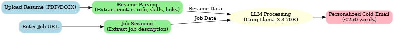

# 📨 AI Cold Email Generator

A Streamlit app that generates **personalized cold/cover emails** for job applications using **Groq LLMs**.  
It takes in a **job description (via URL)** + your **resume** and outputs a professional cold email tailored to the role.  
It also automatically inserts your **contact info (LinkedIn, GitHub, Portfolio, etc.)** from your resume.

---

## ✨ Features
- Extracts job details (title, skills, responsibilities).
- Parses your resume (contact info, skills, portfolio links).
- Generates a personalized cold email in under 250 words.
- Automatically includes your contact info (email, phone, LinkedIn, GitHub).
- Powered by **Groq LLM (Llama 3.3 70B Versatile)**.
- Simple **Streamlit UI**.

---

## 📂 Project Structure
```
app/
├── main.py          # Streamlit UI
├── chains.py        # LLM logic (job extraction + email generation)
├── resume_parser.py # Resume parsing logic
├── portfolio.py     # Portfolio retrieval (skills → project links)
├── utils.py         # Helper functions
├── .env             # Store your GROQ_API_KEY here
├── requirements.txt # Dependencies
└── README.md
```

---

## ⚙️ Installation & Setup

### 1. Clone the repository
```bash
git clone https://github.com/<your-username>/ai-cold-email-generator.git
cd ai-cold-email-generator/app
```

### 2. Create and activate virtual environment (optional but recommended)
```bash
python -m venv venv
# On Windows
venv\Scripts\activate
# On Mac/Linux
source venv/bin/activate
```

### 3. Install dependencies
```bash
pip install -r requirements.txt
```

### 4. Add your Groq API Key
Create a `.env` file inside the `app/` folder:
```
GROQ_API_KEY=your_groq_api_key_here
```

### 5. Run the app
```bash
streamlit run main.py
```

The app will be available at:  
👉 [http://localhost:8501](http://localhost:8501)

---

## 🔄 How It Works (Flowchart)
Below is the flow of how the app works:



---

## 📸 Demo
##

---

## 🚀 Future Improvements
- Polished signature block for emails.
- Multiple email styles (short, formal, casual).
- Option to summarize job description separately.

---

## 🛠️ Tech Stack
- **Streamlit** – UI  
- **LangChain** – Prompt chaining  
- **Groq LLM (Llama 3.3 70B)** – AI model  
- **Python-dotenv** – API key management  
- **pdfplumber, python-docx** – Resume parsing  

---

## 🤝 Contributing
Pull requests are welcome!  
For major changes, please open an issue first to discuss what you’d like to change.

---

## 📬 Author
Made with ❤️ by Rahul Sharma

MIT License

Copyright (c) 2025 Rahul Sharma

Permission is hereby granted, free of charge, to any person obtaining a copy
of this software and associated documentation files (the "Software"), to deal
in the Software without restriction, including without limitation the rights
to use, copy, modify, merge, publish, distribute, sublicense, and/or sell
copies of the Software, and to permit persons to whom the Software is
furnished to do so, subject to the following conditions:

The above copyright notice and this permission notice shall be included in all
copies or substantial portions of the Software.

THE SOFTWARE IS PROVIDED "AS IS", WITHOUT WARRANTY OF ANY KIND, EXPRESS OR
IMPLIED, INCLUDING BUT NOT LIMITED TO THE WARRANTIES OF MERCHANTABILITY,
FITNESS FOR A PARTICULAR PURPOSE AND NONINFRINGEMENT. IN NO EVENT SHALL THE
AUTHORS OR COPYRIGHT HOLDERS BE LIABLE FOR ANY CLAIM, DAMAGES OR OTHER
LIABILITY, WHETHER IN AN ACTION OF CONTRACT, TORT OR OTHERWISE, ARISING FROM,
OUT OF OR IN CONNECTION WITH THE SOFTWARE OR THE USE OR OTHER DEALINGS IN THE
SOFTWARE.
